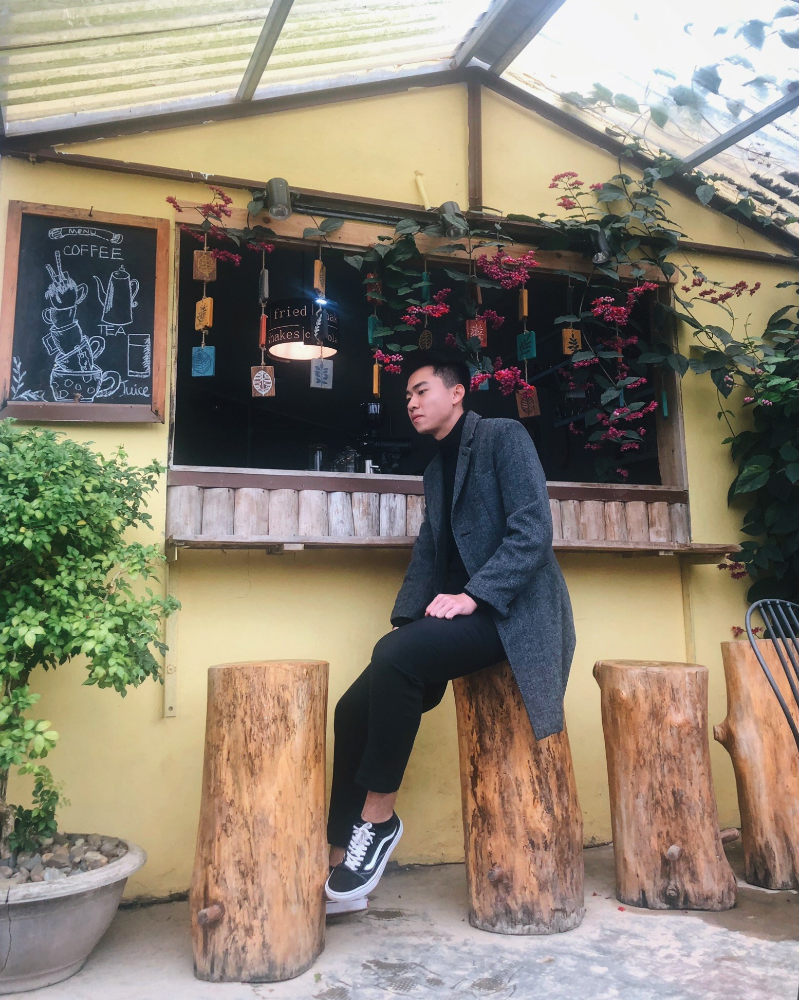
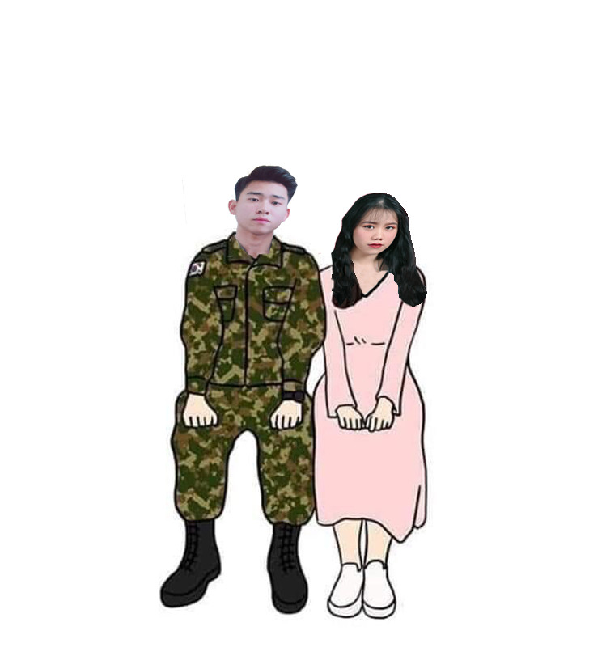
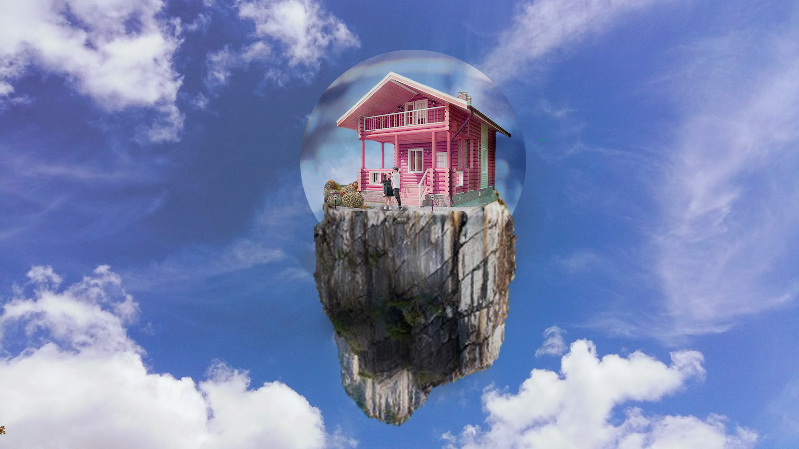

<!DOCTYPE html>
<html lang="en">
<head>
    <meta charset="UTF-8">
    <meta name="viewport" content="width=device-width, initial-scale=1.0">
    <title>Document</title>
    <link rel="stylesheet" href="ladingpage.css">
</head>
<body>
    

        <!-- navbar -->
        

            

                <ul>
                    <li><a href="#">home</a></li>
                    <li><a href="#about">about</a></li>
                    <li><a href="#services">Abilities</a></li>
                    <li><a href="#contactus">contact</a></li>
                    <li><a href="#ourteam">projects</a></li>
                </ul>
            

        

        <!-- banner-img -->
        

            

                

                    

                    <h3>Hi, My name is Sơn.</h3>
                    <h1>Nice to meet you. Welcome to my web CV.</h1>
                    

                

                

                    

                        
                        <ul>
                            <li class="btn active1">01</li>
                            <li class="btn active">02</li>
                            <li class="btn active1">03</li>
                         
                        </ul>
                    

                

            

            
 

        
 
        <!-- about me -->
        

            <h1 class="title">About Me</h1>
            <h3>I am a second-year student at Posts and Telecommunications Institute of Technology.   My main major is Information Technology.  
             I am woking as a Tutor and Teaching assistant English for EDUTALK </h3>
            
<a href="#">Learn More</a>

        

        <!-- services -->
        

            <h1 class="title">My Abilities</h1>
            

    
            

                

                    
                    <h3>About Web</h3>
 I can only use and understand basic JS, HTML, CSS.
                

                

                    
                    <h3>About English</h3>
                    
My TOEIC score is 810 and i can use English pretty well 

                

                

                    
                    <h3>Soft Skills</h3>
                    
Basic Photoshop, communication and Working under pressure

                

            

        

        <!-- contact me -->
        

            <h1 class="title">Contact Me</h1>
            

                

                    <input type="text" placeholder="Email">
                

                

                    <input type="text" placeholder="Message">
                

                

                    <a href="#">Submit</a>
                

            

        

        <!-- My projects -->
        

            <h1 class="title">My Projects</h1>
            

                

                    

                        
                    

                    

                        
                    

                    

                        
                    

                

                

                    

                        
                    

                    

                        
                    

                    

                        
                    

                

            

        
 
    
    
        

            
        

        <!---------------------Scrip chuyển ảnh------------------ -->
        
        <!----------------------------- **------------------------>
        
</body>
</html>

@import url('https://fonts.googleapis.com/css?family=Allura|Josefin+Sans');

/* xét thuộc tính chung cho cả landing page */
*{
	margin: 0;
	padding: 0;
	box-sizing: border-box;
	outline: none;
	list-style: none;
	text-decoration: none;
	font-family: 'Josefin Sans', sans-serif;
}
.main_container{
	position: relative;
}

.btn a{
    display: block;
	width: 180px;
	height: 35px;
	border: 2px solid #fb2274;
	line-height: 30px;
	margin: 25px auto;
	color: #fb2274;
	text-align: center;
}

/* xét thuộc tính cho các title trong lading page */
h1.title{
	margin-top: 20px;
	color: #444444;
	text-transform: uppercase;
	font-size: 38px;
	word-spacing: 10px;
	letter-spacing: 2px;
}

/* Xét thuộc tính ở phần banner img */

.banner_image{
	background: url("https://i.imgur.com/AS8APz9.jpg") top center;
	background-size: cover;
	width: 100%;
	height: 800px;
	display: flex;
	justify-content: center;
	align-items: center;
} 

.row{
    width: 80%;
    min-height: 70vh;
    margin: auto;
    display: flex;
    flex-wrap: wrap;
}
.col {
    margin: 20px 0;
    flex-basis: 50%;
    min-width: 200px;
    height: 100%;
    position: relative;
}
.text-box{
    max-width: 600px;
    margin-top: 100px
}
.text-box h3{
    color: #fb2274;
    font-size: 30px;

}
.text-box h1{
    font-size: 45px;
    font-weight: 100;
    letter-spacing: 0px;
    line-height: 65px;
    color: #fff;
}

.gallery-box{
    max-width: 400px;
    position: relative;
    margin: auto;
}
.gallery-box img{
    width: 107%;
    border-radius: 10%;
    border: 10px solid rgba(255,255,255,0.2);
    box-sizing: border-box;
}
.gallery-box ul{
    position: absolute;
    right: -150px;
    top: 50%;
    transform: translateY(-50%);
}

.gallery-box ul li{
    list-style: none;
    font-size: 20px;
    font-weight: bold;
    padding: 0 30px;
    margin-top: 30px;
    cursor: pointer;
    position: relative

}
.gallery-box .active{
    color:  #fb2274;
}
.gallery-box .active1{
    color: #fff;
}
.gallery-box ul li::after{
    content: '';
    width: 30px;
    heigth: 2px;
    background: transparent;
    position: absolute;
    top: 8px;
    left: -5px;
}

.gallery-box .active::after{
    background: transparent;
    
}

/*------------ Button a -----------------*/
.btn a{
    display: block;
	width: 180px;
	height: 35px;
	border: 2px solid #fb2274;
	line-height: 30px;
	margin: 25px auto;
	color: #fb2274;
	text-align: center;
}
/*------------ navigation bar -----------------*/

.navbar{
	width: 100%;
	height: 80px;
	display: flex;
	align-items: center;
    position: absolute;
    margin-left: 30px;;
}

 .navbar .navbar_items ul{
	display: flex;
}

.navbar .navbar_items ul li{
    text-transform: uppercase;
    font-size: 20px;
    margin: 10px 30px;
 
}

 .navbar .navbar_items ul li a{
	color: #f5f5f5;
}  

  

/* About me */
 .about,
.services,
.contactus,
.ourteam{
	padding: 5% 10%;
	text-align: center;
} 

/* Skills */
.services{
	background: #f5f5f5;
}

.diff_services{
	display: flex;
	margin-top: 35px;
	justify-content: space-between;
}

.diff_service_item{
	width: 30%;
}

.diff_service_item img{
	 width: 100%; 
	margin-bottom: 25px;
}

 .diff_service_item h3{
	color: #fb2274;
	margin-bottom: 15px;
} 

/* Contact Me */
.form_input{
	margin-bottom: 15px;
}

.form_input input[type="text"]{
	width: 250px;
	padding: 12px 20px;
	border: 1px solid #ccc;
}

/* Our Team*/
 .ourteam{
	background: #f5f5f5;
} 

 .ourteam_wrapper .team{
	display: flex;
	justify-content: space-between;
}

.ourteam_wrapper .team-1.team{
	margin-bottom: 25px;
}

 .ourteam_wrapper .team_member{
	width: 30%;
	height: auto;
	cursor: pointer;
	overflow: hidden;
} 

.ourteam_wrapper .team_member img{
	width: 100%;
	display: inline-block;
	height: auto;
	transition: all 0.5s ease;
} 

.ourteam_wrapper .team_member:hover img{
	transform: scale(1.1);
} 

/* footer */
 .footer{
	width: 100%;
	text-align: center;
	background: #444444;
	padding: 20px 0;
} 

 

 @media (max-width: 720px){
	.navbar{
		height: auto;
		flex-direction: column;
	}

	.navbar ul{
		flex-direction: column;
		text-align: center;
	}

	.logo{
		margin-bottom: 25px;
	}

	.navbar ul li{
		margin-bottom: 5px;
	}

	.banner_content{
		margin-top: 35px;
	}
} 

/* arrow */
 .arrow{
	position: fixed;
	bottom: 25px;
	right: 25px;
	width: 40px;
	height: 40px;
	line-height: 50px;
	text-align: center;
	cursor: pointer;
	background: #fb2274;
	border-radius: 50%;
} 

 .arrow img{
	width: 20px;
	height: 20px;
	z-index: 1;
}   
